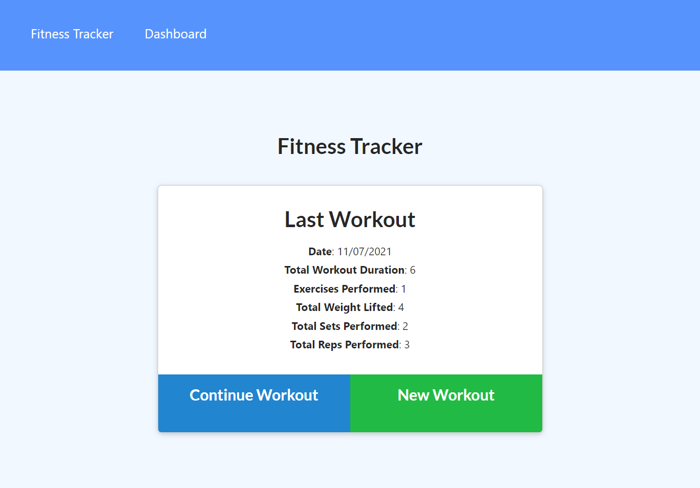
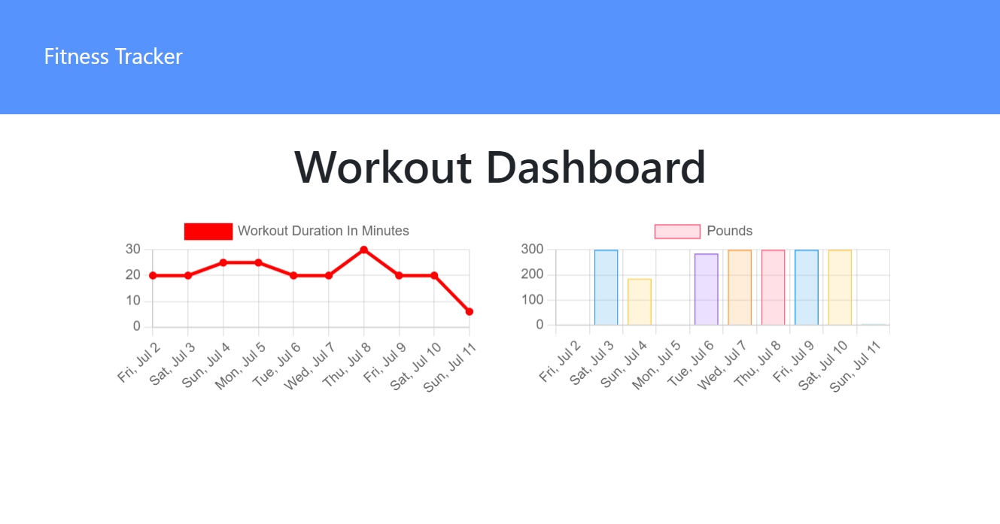

# Easy Workout Tracker  
  


[Here is a link to the deployed App on Heroku](https://easy-fitness-tracker.herokuapp.com/?id=60ead717dc3d640015128395)

[Here is a link to the gitHub repo](https://github.com/brett-treweek/Easy-Workout-Tracker)  


## Description


---
## Table of Contents

- [Installation](#installation)
- [Usage](#usage)
- [License](#license)
- [Contributing](#contributing)
- [Tests](#tests)
- [Technologies](#technologies)
- [Future Development](#future-development)
- [Questions](#questions)

---
## Installation  
  
Please follow these steps to install the project and any dependancies locally.

```bash
install node.js
clone the repo from gitHub
npm install
npm run seed
```

---
## Usage


The best way to try the app is on heroku.  

[Follow this link to easily use the app on Heroku.](https://easy-fitness-tracker.herokuapp.com/?id=60ead717dc3d640015128395)

Run the app locally with the following command.   

```bash
npm start
```
Then open your browser and navigate to:
```bash
localhost:3000
```


---
## License

This project is licensed under 

---
## Contributing

Contributing to this project is not currently available.

---
## Tests

Please use these commands to perform tests.

```js

There are no tests at present.

```

---

## Technologies

- HTML
- CSS
- Javascript
- Node.js
- MongoDB Atlas
- mongoose
- Express
- morgan
- MVC
- Heroku
---
## Future Development
- Responsive Design
- Modern Accessability Implementation

---

## Questions

For any questions and support please contact Brett Treweek  
- Email: bretttrew@gmail.com  
- Github: [brett-treweek](https://github.com/brett-treweek)